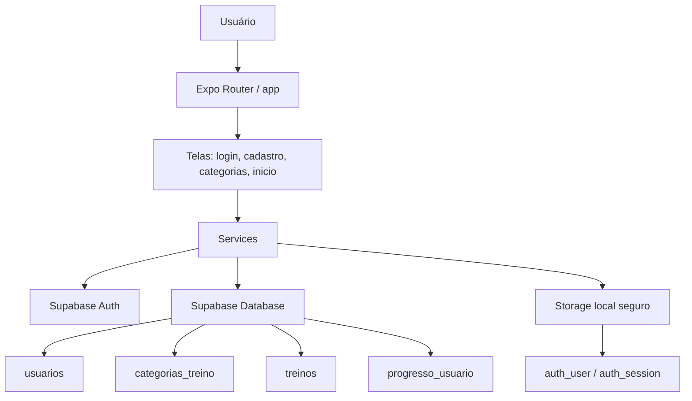

# SwishLab

SwishLab é um aplicativo mobile/web de treinos de basquete construído com Expo, React Native e TypeScript. O projeto organiza conteúdos por categorias e posições de jogo, oferece login e cadastro com Supabase e prepara a base para acompanhar o progresso do usuário em treinos.

## O que o projeto faz

- Autentica usuários com Supabase.
- Cadastra e faz login com email ou nome de usuário.
- Lista categorias e posições de treino.
- Exibe treinos e conteúdos relacionados ao basquete.
- Mantém a sessão do usuário salva entre execuções.
- Estrutura os serviços de dados para evoluir para um backend mais completo.

## Tecnologias

- [Expo](https://expo.dev)
- [React Native](https://reactnative.dev)
- [TypeScript](https://www.typescriptlang.org/)
- [Expo Router](https://docs.expo.dev/router/introduction/)
- [Supabase](https://supabase.com/)
- AsyncStorage

## Estrutura principal

- `app/` - rotas, telas e navegação.
- `services/` - integração com Supabase e regras de autenticação.
- `data/` - dados de treino e posições usados no app.
- `constants/` - tema e tokens visuais.
- `hooks/` - hooks reutilizáveis.
- `components/` - componentes reutilizáveis.

## Requisitos

- Node.js instalado
- npm instalado
- Projeto criado no Supabase
- Variáveis de ambiente configuradas

## Configuração do ambiente

Crie ou ajuste o arquivo `.env.local` na raiz do projeto:

```env
EXPO_PUBLIC_SUPABASE_URL=https://seu-projeto.supabase.co
EXPO_PUBLIC_SUPABASE_ANON_KEY=sua-chave-publica-anon
```

## Como instalar

```bash
npm install
```

## Como rodar

Inicie o projeto com Expo:

```bash
npx expo start
```

Ou use um atalho específico:

```bash
npm run start
```

Outras opções úteis:

```bash
npm run android
npm run ios
npm run web
```

## Fluxo de uso

1. Abra o app.
2. Faça cadastro ou login.
3. A sessão é validada e salva localmente.
4. O app navega para a área autenticada.
5. O usuário pode explorar categorias, posições e treinos.

## Arquitetura



## Como os dados se relacionam

- `auth.users` guarda a autenticação principal.
- `usuarios` guarda o perfil do usuário no banco.
- `categorias_treino` guarda categorias/posições.
- `treinos` guarda os treinos vinculados às categorias.
- `progresso_usuario` guarda o progresso individual do usuário.

## Observações

- O app já está preparado para usar Supabase como base de autenticação.
- Os dados de treino ainda podem coexistir com arquivos locais enquanto a migração total não for concluída.
- Para produção, revise as políticas de acesso e as regras de segurança do Supabase.
